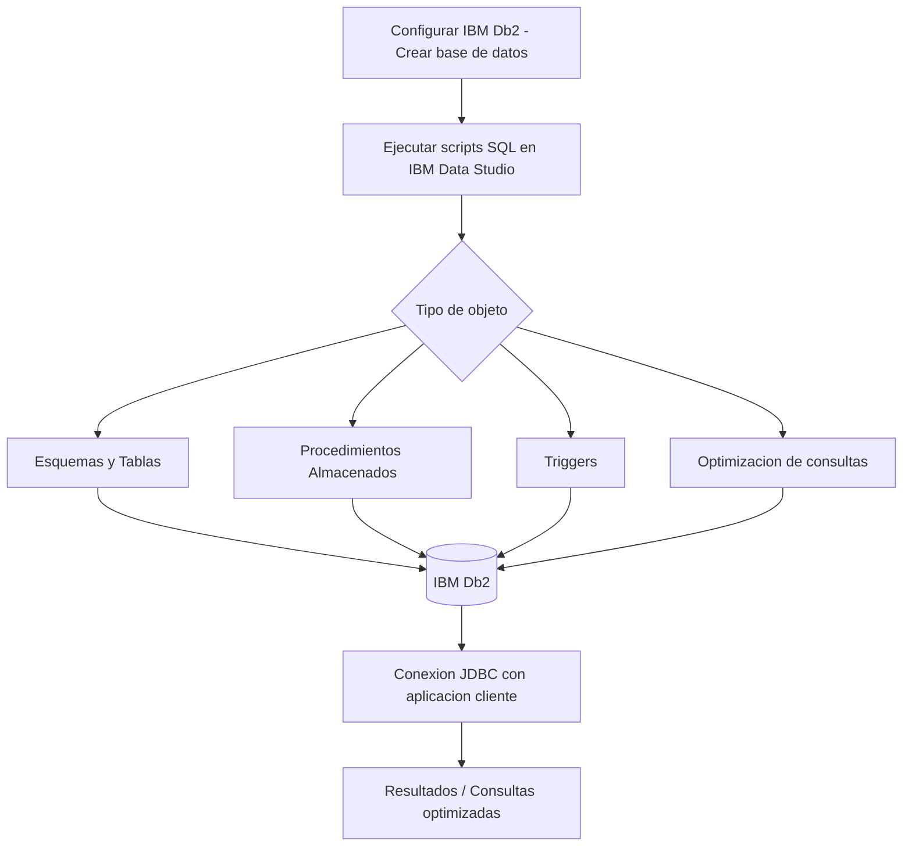

# 📌 Desarrollo SQL Postgrado en IBM  

## 📖 Descripción

---

Este proyecto está enfocado en el desarrollo y optimización de bases de datos en IBM Db2, incluyendo modelado relacional, constraints y procedimientos almacenados.

## 🛠️ Funcionalidades  
- Creación de esquemas de bases de datos en Db2.  
- Optimización de consultas para grandes volúmenes de datos.  
- Implementación de procedimientos almacenados y triggers.  
- Integración con aplicaciones mediante JDBC.  

## 🚀 Tecnologías utilizadas  
- IBM Db2  
- SQL  
- JDBC  
- Data Studio  

## ▶️ Cómo ejecutar el proyecto  
1. Configurar IBM Db2 y crear la base de datos.  
2. Ejecutar los scripts SQL en IBM Data Studio.  
3. Conectar la base de datos con una aplicación cliente.  

## 📌 Autor  
👨‍💻 **Alejandro De Mendoza**

---

## Arquitectura

## Autor

**Alejandro De Mendoza**  
Ingeniero Informático · Especialista en IA · Especialista en Ingeniería de Software · Máster en Arquitectura de Software

